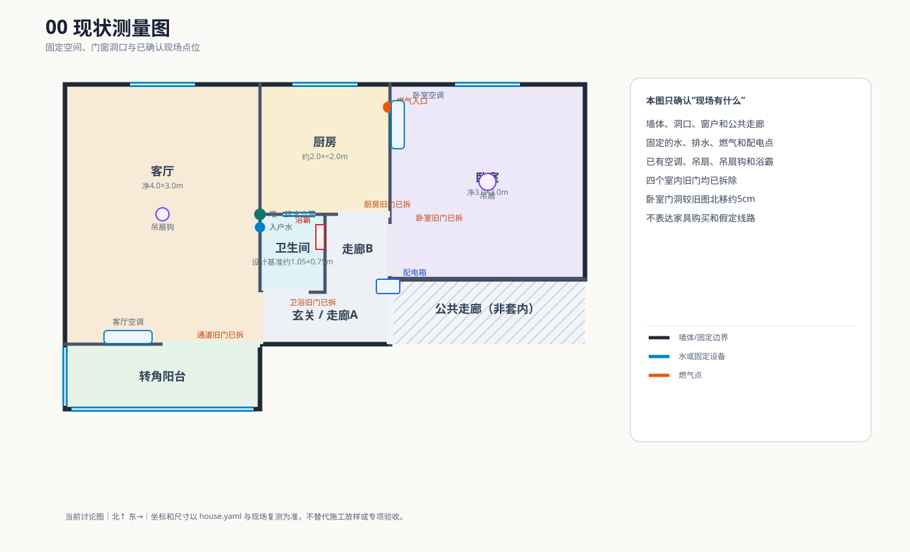
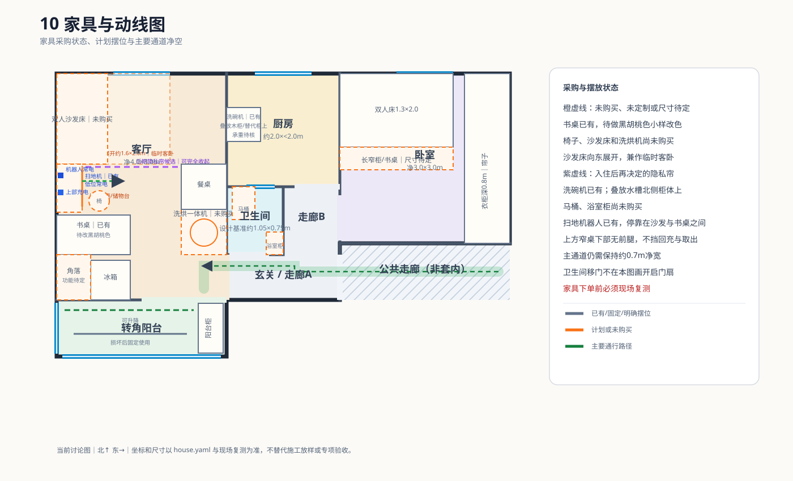

# 32㎡二手房翻新：1万元、三只猫与一套可执行方案

[](https://github.com/lin594/renovation-32m2-10k/actions/workflows/project.yml)

这是一个位于开封的 32㎡ 老房翻新实录。业主既是策划人，也是主要 DIY 执行者；目标是在约 ¥10,000 总预算内，把一室一厅一厨一卫改到三只猫可以安全入住，并尽量只进行一次北京—开封装修专项往返。

仓库同时服务两类读者：人可以从本页、图纸和状态页快速理解方案；程序和 AI 可以从结构化数据中校验账目、采购、工期、风险和空间冲突。

## 先看前后对比

| 改造前：固定边界与已有点位 | 目标方案：家具、功能和动线 |
|---|---|
| [](diagrams/00-existing-survey.svg) | [](diagrams/10-furniture-circulation.svg) |

目标方案的核心变化包括：拆除四扇旧门、全屋明装电路、卫生间蹲厕改马桶、厨卫与墙地面低成本翻新、防猫纱窗、客厅沙发床临时客卧、玄关家庭中枢，以及水槽北侧复用现有洗碗机。

图纸直接使用 SVG；中文由浏览器字体渲染，不再提交缺少中文字形、无法阅读的 PNG 预览。当前仓库只保留一套现行图纸，旧方案通过 Git 历史查看。

## 当前状态

- 施工策略：2026-10-01～10-08 双人主攻；此后零装修专项往返；2027 年 1 月单人收尾。
- 安全边界：老小区户内已确认只有 L/N、无可用 PE；采用分级漏保降低风险，但不把漏保写成接地替代。
- 入住门槛：三猫理想入住日 2027-01-15，硬截止 2027-02-07；防猫、地面、固化、用电和保洁任一项未通过就延期。
- 资金、任务和采购的实时汇总见 [PROJECT_STATUS.md](PROJECT_STATUS.md)。
- 11 张现行图纸的职责见 [diagrams/README.md](diagrams/README.md)。
- 重要方案的现行/已替代关系见 [决策记录索引](docs/decisions/README.md)。
- 最新第三方复核见 [2026-09-01 公开仓库审计](docs/reviews/2026-09-01-public-repository-audit.md)。

## 最容易修改的入口

| 要更新什么 | 修改哪里 |
|---|---|
| 新增支出或收入 | 推荐运行 `python3 scripts/ledger.py expense ...`；也可直接编辑 `data/ledger.csv` |
| 户型、固定点位、家具布局 | `house.yaml` |
| 已有物资与余料 | `data/inventory.yaml` |
| 待购、询价、下单、到货 | `data/procurement.yaml` |
| 阶段和任务 | `data/project.yaml` |
| 工期与入住门槛 | `data/schedule.yaml` |
| 风险与安全门禁 | `data/risks.yaml` |

完整字段说明和示例见 [人类编辑指南](docs/editing-guide.md)。`PROJECT_STATUS.md` 和 SVG 都是派生文件，不应手改。

## 记一笔账

```bash
python3 scripts/ledger.py expense \
  --amount 89.90 \
  --item "厨房排水配件" \
  --category plumbing \
  --room kitchen \
  --date 2026-10-01
```

命令会自动生成下一条 ID、追加 CSV 并刷新公开状态页。若直接在 GitHub 上编辑 CSV，主分支 CI 会重新计算状态页并由机器人提交；原始账本不会被 CI 改写。

## 本地校验

```bash
make status     # 从账本和 YAML 生成 PROJECT_STATUS.md
make diagrams   # 从生成器重建现行 SVG
make check      # 数据、引用、预算、图纸和测试的完整校验
```

## 数据设计

`data/ledger.csv` 是实际收支唯一真源，`data/budget.yaml` 只保存预算上限和预留规则；剩余金额由脚本实时计算，不在多个文件手抄。空间事实以 `house.yaml` 为准，专业方案以 `data/*.yaml` 为准，重要取舍保存在 `docs/decisions/`，历史变化交给 Git。

SVG 是讨论图，不代替现场复测、电气施工图、燃气验收或防水验收。
