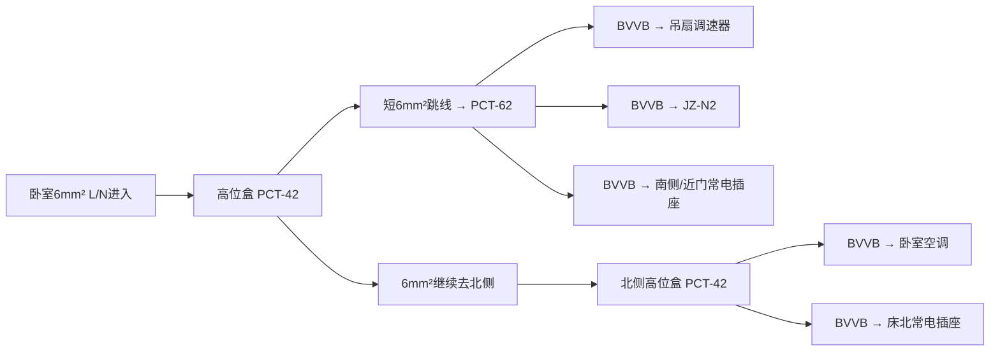
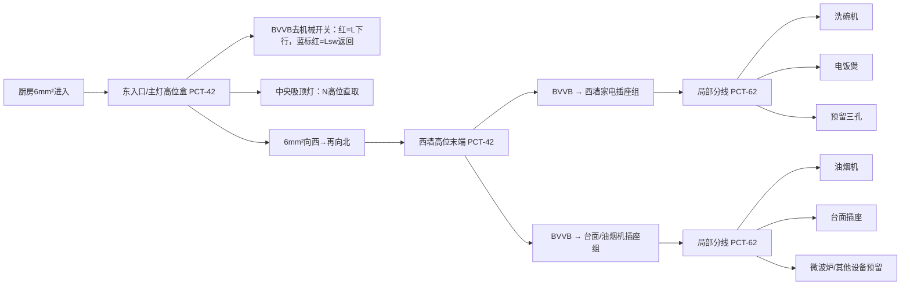
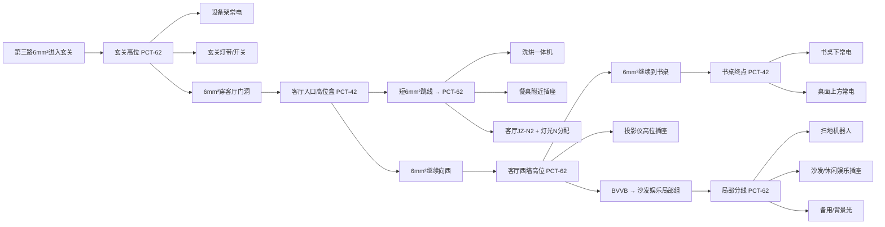
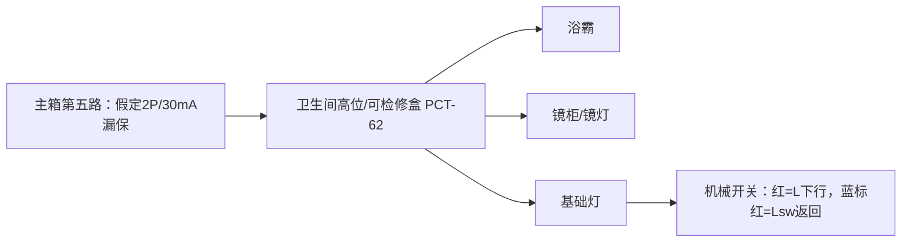

# 开封32㎡五路明装电路路线冻结

**版本：2026-09-29**  
**属性：空间路线、分支节点与接线语义冻结；不是自行通电许可。**  
本版以现场真实位置为主，不再以旧版15个抽象TN节点作为施工阅读入口。过流保护与最小导线的最终匹配另行核验；第五路“主箱原位换2P/30mA漏保”目前是设计假设，购买前必须核实实物尺寸、端子方向和电工意见。

总览图：[`diagrams/38-five-route-electrical.svg`](../../diagrams/38-five-route-electrical.svg)

## 1. 当前五路

| 路 | 当前保护假设 | 服务范围 | 路线读法 |
|---|---|---|---|
| 1 卧室 | 保留现有漏保 | 吊扇、JZ-N2、床侧常电、卧室空调、照明 | 近门物理簇 → 北侧空调/床北终点 |
| 2 厨房 | 保留现有漏保 | 中央主灯、洗碗机、油烟机、电饭煲和预留插座 | 东入口灯控 → 西行/北折 → 西墙总分叉 |
| 3 玄关/客厅生活 | 保留现有漏保 | 设备架、玄关灯带、洗烘、餐桌、客厅灯光、投影、沙发/扫地机、书桌 | 玄关 → 客厅门洞 → 西墙 → 书桌 |
| 4 客厅空调+冰箱 | 保留现有普通空开（本版不处理互换） | 客厅空调、冰箱 | 高位一分二 |
| 5 卫生间 | **假定把该路原位改为2P、30mA漏保** | 浴霸、镜柜/镜灯、基础灯 | 主箱漏保 → 卫生间高位分线 |

本轮**不做前三路与卫生间互换**。

## 2. 统一线材与端子语言

- 高位空间主干：按既定方案继续以BV 6mm² L/N为主要候选；库存蓝色6mm²先确认是BV硬线，再作为N候选。
- 末端与开关：优先BVVB 2×2.5，两芯护套线同时解决机械保护和L/N或两根控制线。
- 不再默认购买1.5mm²灯控线；也不再默认购买BV 1×2.5单芯灯控回线。
- 6mm²节点：PCT-42（每极1进2出）或PCT-62（每极1进3出）。
- 纯2.5mm²局部分线：优先4孔并联小端子；若三个L/N支路恰好成组，也可用现有余量PCT-62。
- 所有固定分线器必须位于带盖、可开启的高位阻燃盒中；不把PCT-42/PCT-62塞在普通86开关/插座暗盒后面。

### 2.1 普通机械开关的省线模板

```text
高位主干L ── BVVB红芯 ──↓机械开关
灯具L      ←─ BVVB蓝芯 ──↑（蓝芯两端圈红色电工胶布，标“Lsw，非N”）
高位主干N ─────────────────→ 灯具N
```

这个模板只用于**专用机械灯控段**。蓝芯一旦在该段定义为Lsw，中途不得重新当N。

## 3. 第一路：卧室

### 3.1 近门/床南一带作为一个物理簇

吊扇调速器、JZ-N2和南侧/近门常电插座彼此接近。**不在低位做总分线盒**，而是在它们上方顶边设置一个可检修高位盒；三条BVVB共用同一条稍宽竖向线槽，下到设备高度后再短距离分开。



因此卧室固定大端子：**PCT-42×2、PCT-62×1**。

### 3.2 卧室JZ-N2

JZ-N2必须得到真实L/N。主灯与床下灯可各走一根BVVB：红芯分别为L1/L2，蓝芯保持N。开关盒中的N如需“一进三出”，使用一只4孔并联小端子，不强行在超薄设备端子里并压多根线。

吊扇调速器继续独立使用原控制逻辑；至吊扇的既有暗线必须先做通断/绝缘检查。

## 4. 第二路：厨房

厨房西侧受推拉门影响，**灯开关固定在入口东侧**。中央吸顶灯保持高位；6mm²主干从入口节点继续向西，随后折向北，到厨房西墙结束。



关键点：

- **6mm²不进入明装插座。** 它只到西墙高位PCT-42，然后缩到BVVB 2×2.5下落。
- 燃气热水器未确定具体型号前，不列为固定220V负载。
- 厨房各实际插座优先买**面板自身带独立机械开关**的款式；不另外拉墙壁控制线。
- 当前已知家具：洗碗机、油烟机、电饭煲；至少再留1～2个三孔位置给微波炉/未来设备。

厨房固定大端子：**PCT-42×2、PCT-62×2**。

## 5. 第三路：玄关与客厅生活

取消旧版“走廊B固定灯”节点。线路只经过走廊B，不因为经过就强行增加用电点。



### 5.1 客厅JZ-N2

- 一根BVVB从高位盒给JZ-N2送真实L/N。
- 第二根BVVB作为双回线：红芯=L1（客厅主灯），蓝芯重新标红=L2（餐区氛围灯）。
- 主灯N、餐区灯N和JZ-N在高位盒内用纯2.5mm²并联小端子分配，避免把多根线硬塞进智能开关。
- 洗烘和餐桌插座从同一个客厅入口高位总盒分出，但各自使用独立BVVB末端支线。

第三路固定大端子：**PCT-62×4、PCT-42×2**。

## 6. 第四路：客厅空调 + 冰箱

本路使用高位固定分线器，语义比两只并联小端子更清楚，也更容易让两条下落线从顶边整齐分开。


PCT-42放在**100×100×50或更大的高位带盖阻燃盒**，不塞进冰箱/空调普通86盒。

第四路固定大端子：**PCT-42×1**。

## 7. 第五路：卫生间

本版先按“第五路在主箱原位置直接改为2P、30mA漏保”画图，**不再增加门外独立漏保小箱**。



浴霸高度提高不能替代漏电保护。本版仍要求卫生间回路具有30mA剩余电流保护。浴霸、镜柜和最终灯具的实际端接方式以设备说明书为准。

第五路固定大端子：**PCT-62×1**。

## 8. 端子采购汇总

按上述真实路径：

| 型号 | 预计使用 | 首批购买 | 主要位置 |
|---|---:|---:|---|
| PCT-62 二进六出 | **8只** | **10只** | 卧室物理簇、厨房两局部插座组、玄关、客厅入口、西墙、沙发组、卫生间 |
| PCT-42 二进四出 | **7只** | **10只** | 卧室主分/北端、厨房入口/西墙、客厅入口一级、书桌终点、第四路 |
| 4孔并联小端子 | 约3～5只 | **10只** | 卧室JZ-N、吊扇N收口、客厅JZ/灯N分配等 |
| 串联型 | 0刚需 | 先不买 | 现场确有直通接长再补 |

空口允许保留，不为了恰好少一个出口再增加SKU。

## 9. 线材采购基线

- 6mm²：库存蓝线仅在确认是BV硬线且状态合格后作为N候选；另购同类型合规相色6mm²作为L。
- BVVB 2×2.5：继续作为绝大多数末端、机械灯控、JZ供电/回线使用。
- **不买1.5mm²。**
- **本版不默认买BV 1×2.5单芯灯控线。**
- 旧版69m/77m的BVVB下料表已经因节点合并和双芯控制策略失效；在墙面按本版路线弹线后重新生成逐段长度。当前100m采购量可继续作为候选上限，但不在本文件宣称“必然足够”。

## 10. 通电前仍未解决的门禁

1. 第五路拟更换漏保的实际型号、模数宽度、端子方向与主箱空间。
2. 现有保护器额定值与所有2.5mm²末端的过流保护匹配。
3. 库存蓝色6mm²究竟是BV还是BVR，以及绝缘/外观状态。
4. 空调、洗烘、浴霸等设备铭牌和插头规格。
5. 所有固定线路绝缘、极性、端子紧固、漏保TEST以及动作电流/动作时间实测。

任何一项未通过，对应新建固定线路保持断开。
