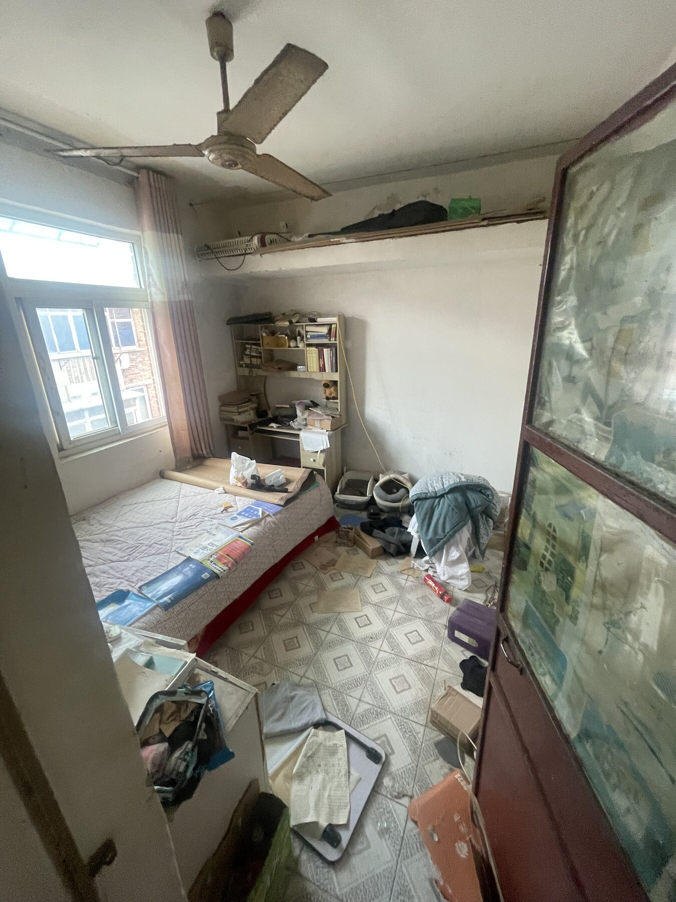
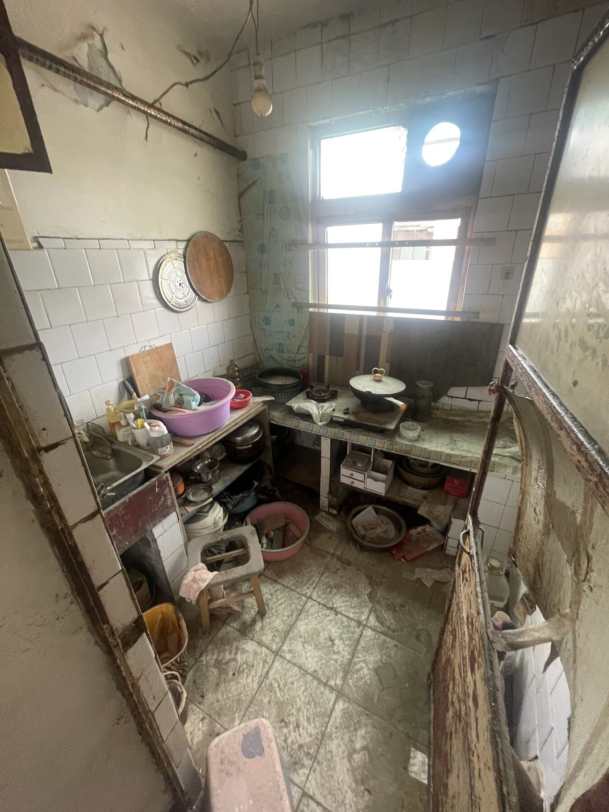
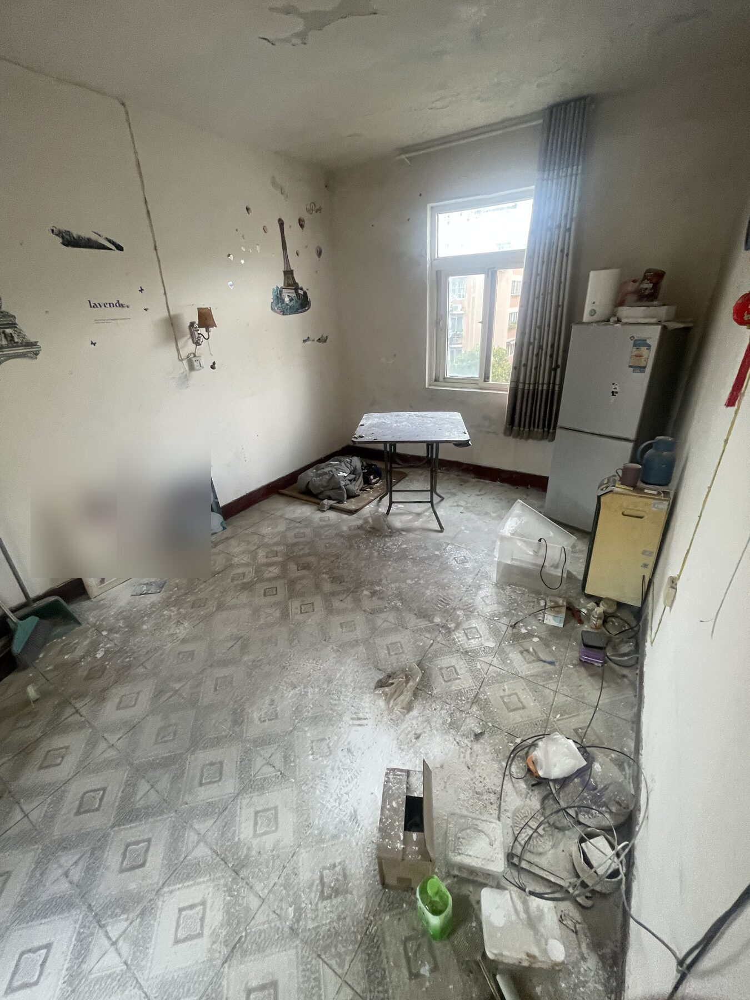
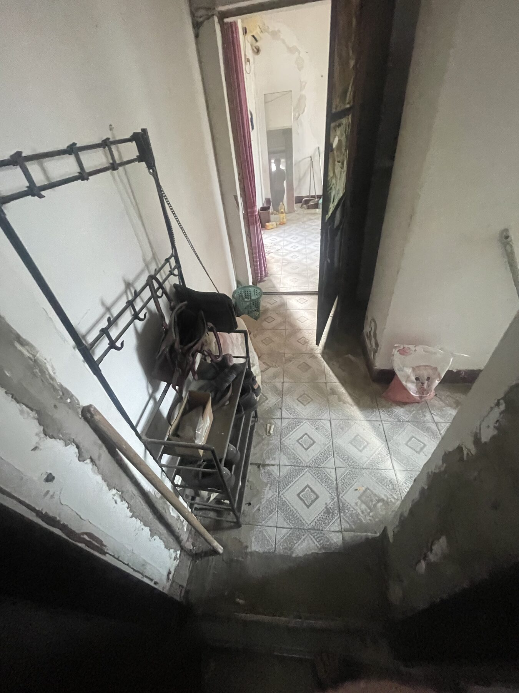
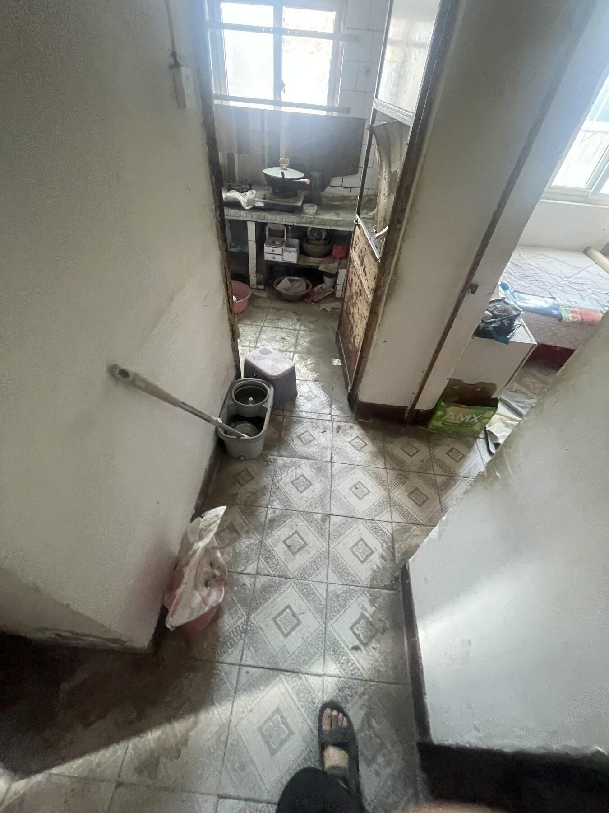
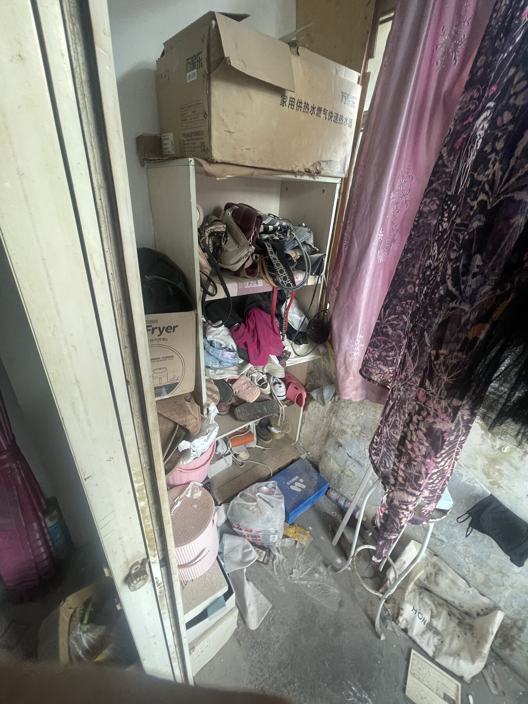
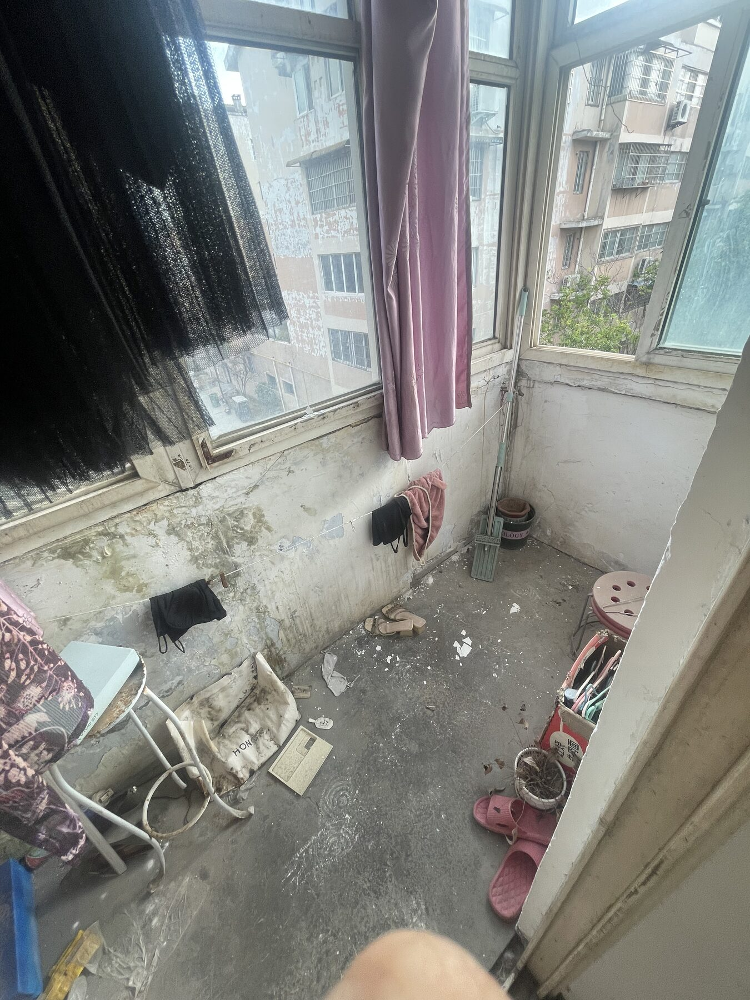
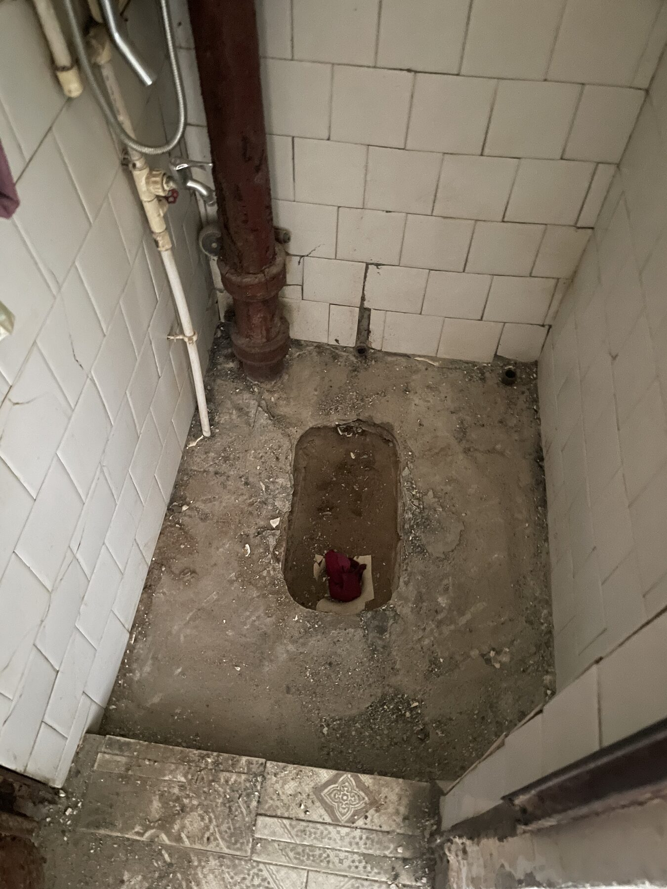

<!-- 本文件由 scripts/photo.py gallery 自动生成，请修改 data/photos.csv 或使用导入命令。 -->
# 现场照片档案

照片按房间组织，并在房间内依次展示装修前、施工中和完工阶段。尚未拍摄的阶段会明确留空，不用效果图冒充实景。

公开照片均已压缩并移除元数据；原始 HEIC 只保存在本地 `.local/photos-original/`。新增照片请参考[人类编辑指南](../../docs/editing-guide.md)。

## 卧室

### 装修前

2026-08-24 · `PHOTO-0001` · 装修前卧室全景：原吊扇、窗帘、床台和旧柜体。

### 施工中

_尚未拍摄。_

### 完工

_尚未拍摄。_

## 厨房

### 装修前

2026-08-24 · `PHOTO-0002` · 装修前厨房全景：原瓷砖灶台、水槽、明管和旧收纳。

### 施工中

_尚未拍摄。_

### 完工

_尚未拍摄。_

## 客厅

### 装修前

2026-08-24 · `PHOTO-0003` · 装修前客厅全景：墙顶脱皮、旧地面及待清场物品。

> 隐私处理：画面内人物家庭照已模糊

### 施工中

_尚未拍摄。_

### 完工

_尚未拍摄。_

## 走廊A（玄关）

### 装修前

2026-08-24 · `PHOTO-0004` · 装修前走廊A全景：入户、客厅通道和原有挂架。

### 施工中

_尚未拍摄。_

### 完工

_尚未拍摄。_

## 走廊B

### 装修前

2026-08-24 · `PHOTO-0005` · 装修前走廊B全景：连接厨房、卫生间与走廊A。

### 施工中

_尚未拍摄。_

### 完工

_尚未拍摄。_

## 转角阳台

### 装修前

2026-08-24 · `PHOTO-0006` · 装修前转角阳台向东视图：旧窗帘、收纳和原地面。

2026-08-24 · `PHOTO-0007` · 装修前转角阳台向西视图：窗下墙面和原地面。

### 施工中

_尚未拍摄。_

### 完工

_尚未拍摄。_

## 卫生间

### 装修前

_尚未拍摄。_

### 施工中

2026-08-27 · `PHOTO-0008` · 卫生间拆除蹲坑后的阶段记录：原排污口、管道与待处理基层。

### 完工

_尚未拍摄。_

## 后续拍摄约定

尽量站在同一门口、使用相近焦段和方向拍摄；先记录全景，再补充墙面、管线、柜体和收口细节，以便形成可信的前后对比。
